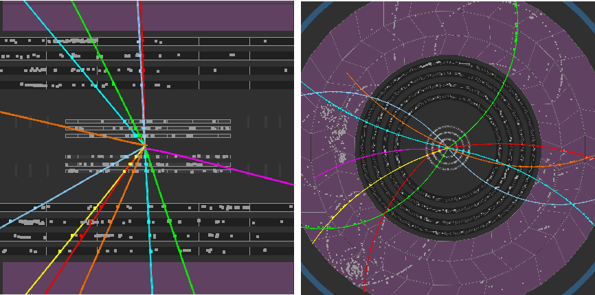
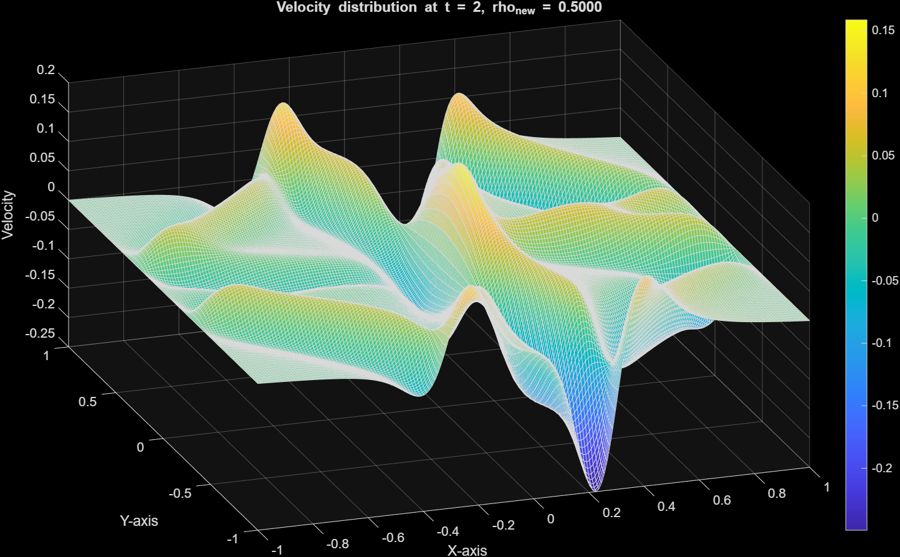

## Hello!

I'm a **third-year MSc student in Engineering Physics** at Uppsala University.  
Here I upload a mix of **coursework, projects, hackathon code, and other programming-related things** I’ve worked on.

This GitHub profile is where I upload:
- 📘 **Coursework & assignments**
- 🧪 **Computational and numerical projects**
- 🚀 **Hackathon code**
- 🔧 **Personal side projects**

---

### 🚧 Current project focus
- Machine learning for particle tracking (ML Track Challenge–inspired) _bachelor thesis_
- Numerical methods for PDEs and scientific computing  
- Computational physics and simulations  
- Data analysis, algorithms, and machine learning  

  
  &nbsp;&nbsp;&nbsp;
  
   
  <em>Visualization of particle track reconstruction in the TrackML challenge for LHC detectors at CERN.</em>

---

### 📂 What you’ll find here
- **Course repositories** – structured solutions, reports, and implementations  
- **Hackathons** – fast-paced problem solving and prototypes  
- **Side projects** – experiments beyond coursework  

Repositories aim to be **clear, reproducible, and well-documented**.

  
   
  <em>Numerical solution of the 2D acoustic wave equation with varying densities using SBP–projection methods, as part of a course project.</em>

---

### 🛠 Tech I often use
- **Languages:** Python, MATLAB, C/C++  
- **Tools:** NumPy, SciPy, Matplotlib, Pandas, LaTeX, Git
- 
📫 Feel free to reach out via GitHub or [LinkedIn](https://www.linkedin.com/in/felixjmartin/).

