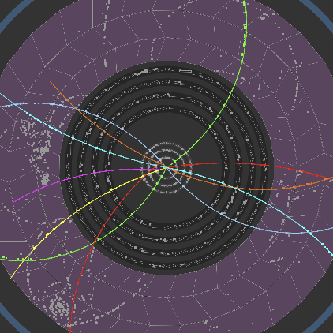

# Hello! 👋

I'm **Felix Martin**, a third-year MSc student in **Engineering Physics** at Uppsala University.

Computational physics & ML student at Uppsala University. 
I use GitHub to showcase coursework, research projects, and hackathon solutions.
---

## 🔬 Current Focus

**Bachelor Thesis**: Machine learning for particle tracking (TrackML Challenge–inspired)
- Developing algorithms for high-energy physics detector reconstruction
- Working with CERN LHC detector data
- Implementing track pattern recognition using ML techniques

**Research interests**:
- Computational physics and numerical methods
- Scientific machine learning
- Data analysis and algorithm development

  
  &nbsp;&nbsp;&nbsp;
  
   
  <em>Particle track reconstruction in the TrackML challenge for LHC detectors at CERN</em>

---

## 📂 What You'll Find Here

🎓 **Course Projects** — Structured implementations from advanced physics and ML courses  
🏆 **Hackathons** — Fast-paced problem solving and prototypes (CISPA, Uppsala challenges)  
🔧 **Side Projects** — Experiments in simulation, optimization, and scientific computing  

All repositories aim to be **clear, reproducible, and well-documented**.

  
   
  <em>Numerical solution of the 2D acoustic wave equation using SBP–projection methods</em>

---

## 🛠️ Tech Stack

**Languages**: Python • MATLAB • C/C++  
**Scientific Computing**: NumPy • SciPy • Matplotlib • Pandas  
**Tools**: Git • LaTeX • Jupyter 

---

## 📫 Connect

Feel free to reach out!

---

