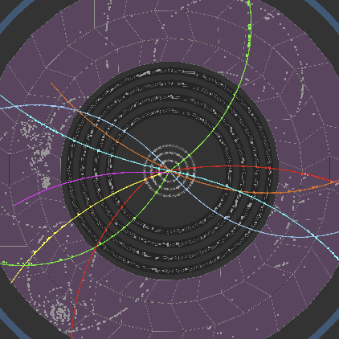

# Felix Martin
MSc Engineering Physics, Uppsala University, specialising in 
computational science and machine learning.

---

## Current work

**Bachelor thesis — ATLAS Particle Physics Group, Uppsala University**
Developing deep learning models to detect and reconstruct signals 
from experimental data collected at CERN's Large Hadron Collider. 
Benchmarking neural network architectures on large-scale, complex 
physics datasets.

  
  &nbsp;
  
   
  <em>Particle track reconstruction in LHC detector data</em>

---

## Projects & hackathons

**Multi-agent disinformation tracker** — Top 5, Google x Epiminds Hackathon.
Built a multi-agent retrieval system using Claude to scrape and analyse 
web sources in real time for disinformation detection.

**VSCode developer assistant** — 2nd place, KTH AI Society x Florent Venture Hackathon.
VSCode extension with a React frontend connected to a Claude-powered 
backend for real-time developer assistance.

**Open-source eye tracker** — Winner, Antler's National Start-up Buildathon.
Built in React, capturing and storing gaze coordinate data for 
cognitive analysis.

---

## Background

Physics and mathematics foundation with a computational science and 
AI specialisation. covering probabilistic ML, numerical methods, and 
scientific computing.

  
   
  <em>Numerical solution of the 2D acoustic wave equation using SBP-projection methods</em>

---

## What's here

Course projects, research code, and hackathon submissions. Mostly Python.
Kept readable and reproducible.

---

## Skills

Python (PyTorch, NumPy, SciPy, Pandas, scikit-learn) • LLMs & API Integration 
- Multi-Agent Systems • Git/GitHub • Linux/Bash • MATLAB • LaTeX

---

## Contact
[LinkedIn](https://www.linkedin.com/in/felixjmartin/) • felix.martin@hotmail.se
