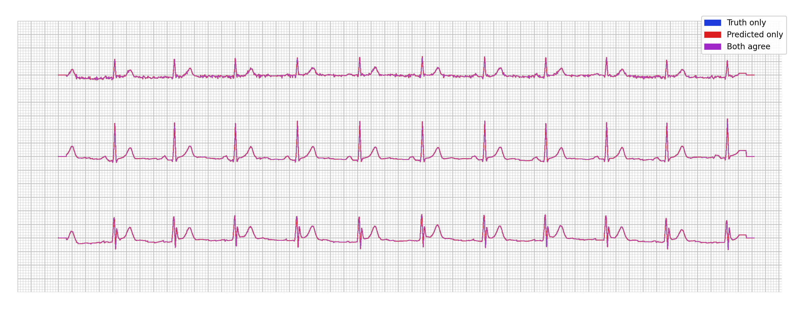

# Felix Martin

MSc Engineering Physics @ Uppsala University — computational science and machine learning applied to physics and engineering.

- **Engineering intern @ [Redpine](https://www.redpine.ai/)** — retrieval systems at the intersection of semantic search and agentic methods
- **ML research assistant @ Uppsala** — arrhythmia classification models trained on 3M+ ECG recordings
- **Bachelor's thesis @ ATLAS / CERN** — neuromorphic ML for signal detection in LHC data

## Now

**Engineering intern — Redpine, Stockholm**
Improving retrieval systems by layering agentic methods over semantic
search, and building agentic evaluations to quantify retrieval quality.

**ML research assistant — Department of Information Technology, Uppsala University**
Developing deep learning models that classify cardiac arrhythmias from
3M+ ECG recordings, mapping rhythm disorders to their electrical signal
patterns to support clinical decisions.

## Research

**Bachelor's thesis — ATLAS Particle Physics Group, Uppsala University**

Developed neuromorphic learning models to detect and reconstruct particle
signals from data collected at CERN's Large Hadron Collider. Benchmarked
neural network architectures on large-scale, sparse, high-multiplicity
physics datasets.

  
   
  <em>Particle track reconstruction in LHC detector data using a two-stage filtering neural network</em>

  
   
  <em>Spiking neural network neurons learning to fire — membrane potentials and spike events over time</em>

**ML research assistant — Uppsala University**

U-Net segmentation model that extracts ECG waveform traces from plot images, trained on the PTB-XL dataset — a step toward automatically digitising ECG rhythm data for arrhythmia classification.

  
  
   
  <em>The U-Net architecture (from Ronneberger, Fischer &amp; Brox, <a href="https://arxiv.org/abs/1505.04597">"U-Net: Convolutional Networks for Biomedical Image Segmentation"</a>, 2015) and the trained model's prediction overlaid on an ECG plot — purple = predicted and true trace agree</em>

## Projects & hackathons

**Multi-agent disinformation tracker** — Top 5, Google × Epiminds Hackathon
A multi-agent retrieval system using Claude to scrape and analyse web
sources in real time for disinformation detection.

**VSCode developer assistant** — 2nd place, KTH AI Society × Florent Venture Hackathon
A VSCode extension with a React frontend and a Claude-powered backend for
real-time developer assistance.

**Open-source eye tracker** — Winner (local round), Antler's National Start-up Buildathon
Built in React, capturing and storing gaze-coordinate data for cognitive
analysis.

## Background

A physics and mathematics foundation with a computational science and AI
specialisation — probabilistic ML, numerical methods, and scientific
computing.

  
   
  <em>Numerical solution of the 2D acoustic wave equation using SBP-projection methods</em>

## What's here

Course projects, research code, and hackathon submissions. Mostly Python,
kept readable and reproducible.

## Skills

- **ML & AI:** PyTorch · scikit-learn · LLMs & API integration · RAG & retrieval · multi-agent systems
- **Data & engineering:** Python (NumPy, SciPy, Pandas) · SQL · Git/GitHub · Linux/Bash
- **Scientific:** MATLAB · LaTeX · numerical methods · HPC (SLURM)

## Contact

[LinkedIn](https://www.linkedin.com/in/felixjmartin/) · felix.martin@hotmail.se
