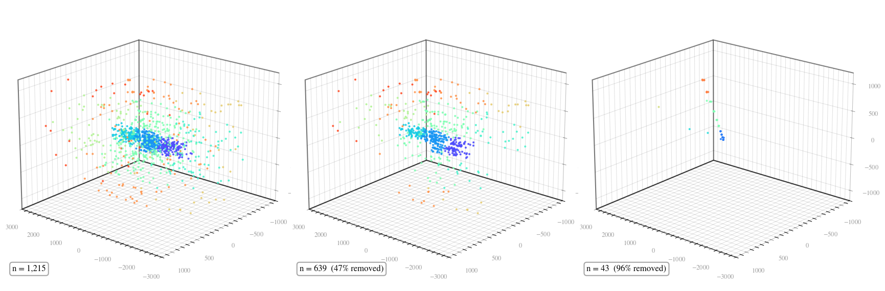
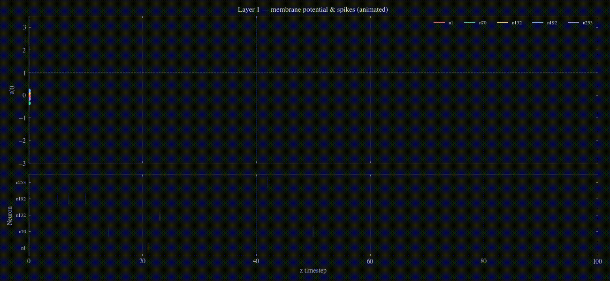
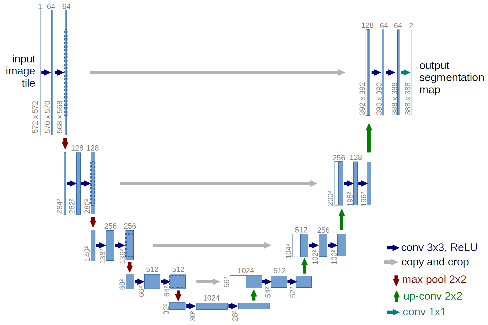
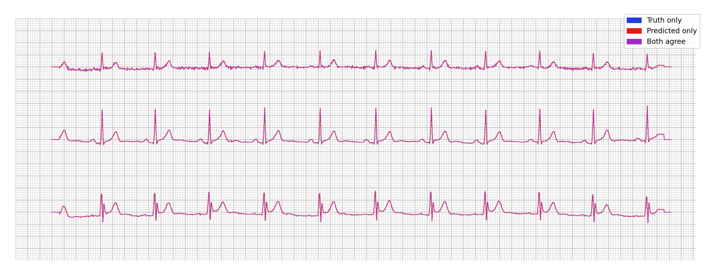
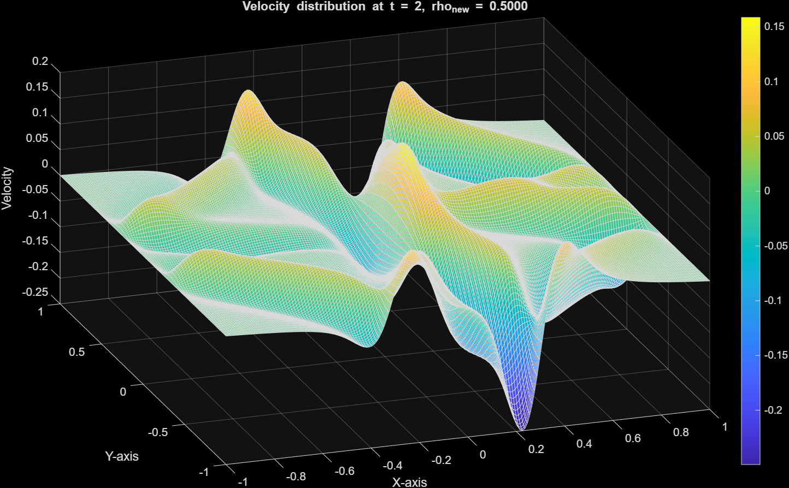

# Felix Martin

MSc Engineering Physics @ Uppsala University: computational science and machine learning applied to physics and engineering.

- **Data scientist (part-time) @ Locus Energy**
- **Engineering intern @ [Redpine](https://www.redpine.ai/)**
- **ML research assistant @ Uppsala University**
- **Bachelor's thesis @ ATLAS UU Group/ CERN**

## Now

**Data scientist (part-time): Locus Energy, Stockholm**
Building probabilistic forecasting models (Bayesian methods, state-space
models, LSTMs) to predict revenue from intermittent renewable generation
under market volatility.

**ML research assistant: Department of Information Technology, Uppsala University**
Developing deep learning models that classify cardiac arrhythmias from
3M+ ECG recordings, mapping rhythm disorders to their electrical signal
patterns to support clinical decisions.

## Research

**Bachelor's thesis: ATLAS Particle Physics Group, Uppsala University** ([paper](https://urn.kb.se/resolve?urn=urn:nbn:se:uu:diva-597824))

Developed neuromorphic learning models to detect and reconstruct particle
signals from data collected at CERN's Large Hadron Collider. Benchmarked
neural network architectures on large-scale, sparse, high-multiplicity
physics datasets.

  
   
  <em>Particle track reconstruction in LHC detector data using a two-stage filtering neural network</em>

  
   
  <em>Spiking neural network neurons learning to fire: membrane potentials and spike events over time</em>

**ML research assistant — Uppsala University**

U-Net segmentation model that extracts ECG waveform traces from plot images, trained on the PTB-XL dataset — a step toward automatically digitising ECG rhythm data for arrhythmia classification.

  
   
  
   
  <em>Ground-truth trace mask (top) and the trained model's prediction overlaid on the original ECG plot (bottom, purple = predicted and true trace agree)</em>

## Projects & hackathons

**Multi-agent disinformation tracker** — Top 5, Google × Epiminds Hackathon
A multi-agent retrieval system using Claude to scrape and analyse web
sources in real time for disinformation detection.

**VSCode developer assistant** — 2nd place, KTH AI Society × Florent Venture Hackathon
A VSCode extension with a React frontend and a Claude-powered backend for
real-time developer assistance.

**Open-source eye tracker** — Winner (local round), Antler's National Start-up Buildathon
Built in React, capturing and storing gaze-coordinate data for cognitive
analysis.

## Background

A physics and mathematics foundation with a computational science and AI
specialisation — probabilistic ML, numerical methods, and scientific
computing.

  
   
  <em>Numerical solution of the 2D acoustic wave equation using SBP-projection methods</em>

## What's here

Course projects, research code, and hackathon submissions. Mostly Python,
kept readable and reproducible.

## Skills

- **Quantitative & ML:** Deep Learning · Time-Series Forecasting · Signal Processing · Optimization & Monte Carlo Methods
- **Programming & Data:** Python (NumPy/Pandas, PyTorch, scikit-learn) · SQL · Git (CI/CD) · Linux/Bash · HPC (SLURM)

## Contact

[LinkedIn](https://www.linkedin.com/in/felixjmartin/) · [Google Scholar](https://scholar.google.com/citations?user=LAkZGKgAAAAJ&hl=sv) · felix.martin@hotmail.se
